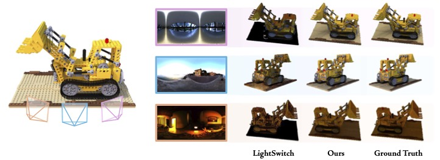

  <h1 align="center">RelightFormer: Feed-forward Generative Transformer for Multiview Object Relighting</h1>
  

    <strong>Siggraph Asia 2026</strong>
  

  

    
    
  

  

<!-- ## 🎥 Demo -->

  <video src="./demo/video.mp4" controls width="80%" style="border-radius: 10px; box-shadow: 0 4px 15px rgba(0,0,0,0.2);">
    Your browser does not support the video tag.
  </video>

  <em>Can't see the video? <a href="./demo/video.mp4">Click here to download and watch</a>.</em>

---

## Overview

We present **RelightFormer**, a feed-forward generative transformer for multiview object relighting. Our method enables realistic relighting of 3D objects from multiple viewpoints with unprecedented quality and efficiency.

-  **Feed-forward Architecture**: No iterative optimization required
- 🌟 **Multiview Consistency**: Coherent relighting across all viewpoints  
- ⚡ **Fast Inference**: Real-time performance on modern GPUs
- 🎨 **High Quality**: Photorealistic relighting results

## 📦 Dataset & Code

**Code and dataset coming soon!** Stay tuned for updates.

## License

This work is licensed under CC BY-NC-SA 4.0.

## Acknowlegements

This work was supported in part by National Natural Science Foun-
dation of China under Grant 62271431, in part by Research Grants
Council of Hong Kong under Grants 15219125 & 15228626 & 15225522,
in part by Otto Poon Charitable Foundation Smart Cities Research
Institute (8-CDCQ), in part by Research Center for Unmanned Au-
tonomous Systems (1-CE3D), and in part by PolyU Kunpeng &
Ascend Technology Innovation Incubation Center, The Hong Kong
Polytechnic University.